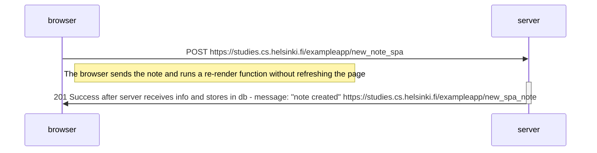

```mermaid
  sequenceDiagram
    participant browser
    participant server
    
    browser->>server: POST https://studies.cs.helsinki.fi/exampleapp/new_note_spa
    Note right of browser: The browser sends the note and runs a re-render function without refreshing the page
    activate server
    server->>browser: 201 Success after server receives info and stores in db - message: "note created" https://studies.cs.helsinki.fi/exampleapp/new_spa_note
    deactivate server
```